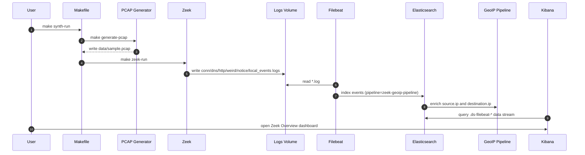
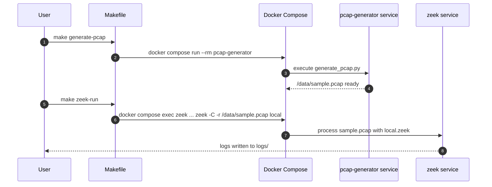
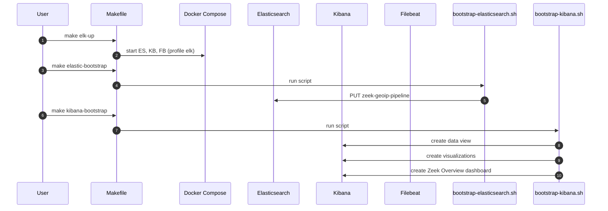
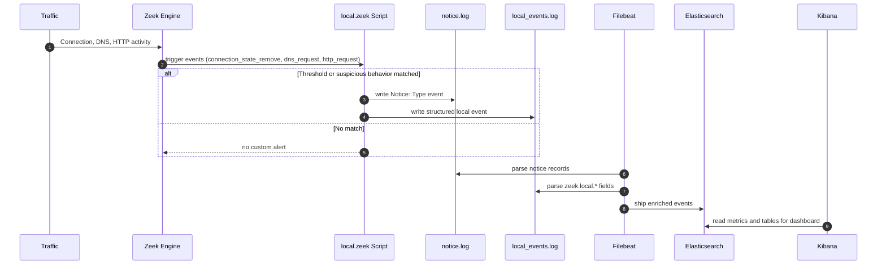

# Zeek + ELK Sequence Diagrams

This page captures the main runtime and bootstrap flows in Mermaid sequence format.

## 1) End-to-End Analysis Flow

## 2) Synthetic Traffic Generation and Processing

## 3) ELK Bootstrap and Dashboard Provisioning

## 4) Custom Zeek Detection Path

